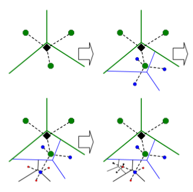
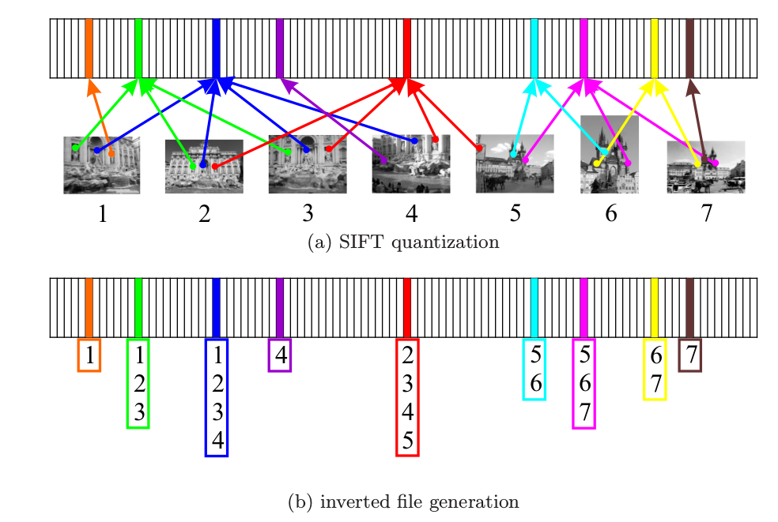
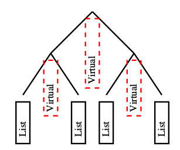
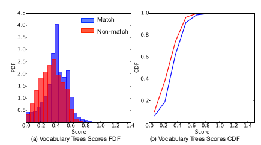
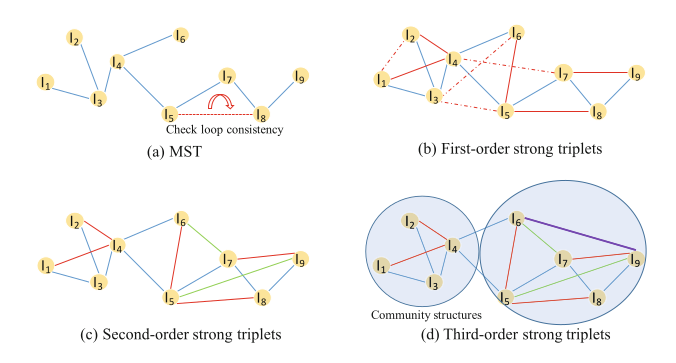
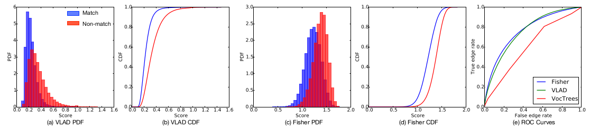

# Viewing Graph

Let's first define what is a **Viewing Graph(VG)**.

***Definition**: A Viewing Graph is a graph which nodes represent images and edges represent the number of matches between two nodes.*

**Viewing Graph** is also called a **Match Graph**, which is first adopted by [2] - a milestone work of **Structure from Motion**.
As we know, **Feature Matching** is one of the main bottlenecks of 3D reconstruction. For sequential datasets, matching could performed only to its $k$
previous images. However, for unordered datasets, the exhaustive matching process takes lots of time. Thus, the structure of **Viewing Graph** should be explored to reduce the number of matching. 

## 1. Vocabulary Tree
词汇树最初是用来做object recognition的，但是在三维重建中(SfM和SLAM)也被大量使用。

### 1.1 词汇树的构建
词汇树实际上就是一棵多层k叉树，通过反复的k-means聚类来得到。假设我们已经得到特征点的描述子，这些描述子则被用来构建词汇树。和原来的k-means聚类不同的是，原来的k指的是最终的聚类数量，而词汇树中的k指的是每一次迭代中的分支数目。首先，一个初始的k-means用于定义k个聚类中心，然后这些数据就被分成k组，每个组所包含的描述子到k-means聚类中心的距离最近。然后，该过程被反复调用，直到达到一个人为设定的参数-L层。如下图所示：
<div align=center> 



</div>
词汇树的内存大小和叶节点的数量成正比。对于D维的描述子，构建一棵L层k个分支的词汇树，需要Dk^L字节(假设描述子的每个维度占用1字节)。因此，对于128维的SIFT描述子，构建一棵6层的10分支的词汇树，会产生1M的叶节点，需要占用143M的内存。

### 1.2 评分(score)的定义
其实之前一直不太明白词汇树的评分怎么能够定义图片之间的相似度。然后看了参考文献[1]。词汇树的相似度借用了文本检索的方法。首先来看看文本检索中相似度怎么算的。

假设一个拥有k个单词的词汇表，那么每个文本可以被一个k维向量表示：

其中，每一项的计算公式为

<div align=center> 


</div>
其中，是单词i在文档d中出现的次数，是文档d中的单词总数，是单词i在整个数据库中出现的次数，N是整个数据库中的文档数。
这个权重定义方法称为Term Frequency-Inver Document frequency (TF-IDF) - 它由两项的乘积组成：word frequency 以及inverse document frequency 。这么做的intuition是(直接翻译不太好讲，就借用原文):

```word frequency weights words occurring ofter in a particular document, and thus describe it well, whilst the inverse document frequency down-weights words that appear ofter in the database.```

在检索的时候，文本根据查询向量v_q和其他所有向量v_d之间的归一化标量积(normalized scalar product)来排名。

但是在[2]里，对于图片之间的相似度评分，稍微做了修改。在词汇树中，查询图片和数据库中图片的相关性需要通过比较数据库中描述子沿着词汇树的路径和查询图片描述子沿着词汇树的路径的相似性(大致理解就是这样，原文是: we wish to determine the relevance of a database image to the query image based on how similar the paths down the vocabulary tree are for the descriptors from the database image and the query image)。[2]中的方法是：对词汇树中的每一个节点都赋予一个权值，并且定义查询向量和数据库向量：
<div align=center> 


</div>
其中和分别是所查询图片和数据库图片的描述子向量通过节点i的数量。的定义和[1]中IDF的定义相似：

<div align=center> 


</div>

其中N是数据库中图片的数量，是数据库中至少有一个描述子向量通过节点i的图片数量。然后查询向量和数据库向量之间的相似度评分通过下面的公式来定义：

<div align=center> 


</div>

实际上就是两个归一化之后的向量的差的范数。上面公式中的范数理论上可以使用任意形式的范数，但是[2]中发现L1-范数比L2-范数得到的结果要更好。

### 1.3 评分的实现

为了高效地进行评分，[2]使用了```inverted file```。inverted file存储的是某个节点出现在的图片的id(这个节点有可能在很多张图片中出现，因此存储了多个id)，以及该描述子在数据库中出现的总数。可以通过下图理解：
<div align=center> 



</div>

[2]中的实现只存储了叶节点的inverted file,而对于内部节点的inverted file，就是叶节点的inverted files的简单的连接。也可以通过下图理解：
<div align=center> 



</div>

到此，词汇树的基本上讲解完了，更细节的内容还是见[1,2]两篇参考文献。对于vocabulary tree的实现，可以见Tianwei的工作[libvot](https://github.com/hlzz/libvot)以及Noah Snavely大神的实现[VocabTree2](https://github.com/snavely/VocabTree2)。

## 2. BRIAD<sup>[2]</sup>
In [2], vocabulary tree is used to measure the similarity of two images. For each image, the top scoring $k_1 + k_2$ images are identified, where the first $k_1$ images are used in an initial verification stage, and the additional $k_2$ images are used to enlarge the connected components. After the initial graph has been built, there may exist more than 1 connected components. For components of size 2 or more, the next $k_2$ images that suggested by the vocabulary tree are used to enlarge the graph. It should be noticed that, only image pairs that straddle two different connected components are considered. This step is called **components merging**. After component merging, the match graph is usually not dense enough to reliably produce a good reconstruction. Then, a **Query Expansion** step is proposed to enhance the match graph. Images $i$ and $j$ are connected if they have a certain minimum number of features in common. If image $i$ is connected to image $j$ and image $j$ is connected to image k, a detailed match is performed to check if image $i$ matches image $k$ (It should be noticed that, there is an error in the original paper). 

However, in that repeated query expansions lead to drift, where the context of the iamges found rapidly diverge from that of the initial image, especially as it starts examinging the neighbors of the neighbors, and so on. Although the geometric verification step in the matching process ensures that these pairs are not admitted into the graph as edgs, it greatly reduces the efficiency of the overall matching process because it tests more pairs unlikely to share edges - more query expansion, less efficient.
___
Although vocabulary tree help SfM pipelines find suitable image pairs to match more quickly, according to Cui [3], vocabulary tree has some disadvantages:

-  Constructing a vocabulary tree is computationally expensive (due to the computation of a tree encoding visual words and the iamge index) and can demand a large memory footprint. Specifically, creating the vocabulary tree requires an expensive clustering pass on a large set or subset of local image features for every node in the tree.

- Creating an image index requires passing each of the local features of every image in a dataset through the vocabulary tree, which is also computationally expensive.

- SfM pipelines have to load the image index in memory to find suitable image pairs to match in a large photo collection. In this scenario, substantial memory footprints are necessary since the image index is large as well.

Besides, the image representation that vocabulary tree use provides limited information about matching image pairs, as is shown in the figure below, the distribution of vocabulary trees similaarity scores for matching and non-matching image pairs overlap significantly.

<div align=center> 



</div>

## 3. Graph-based Consistency Matching

This work try to detect bad matches by checking loop consistency. The ituition is: *errorneous matches causes the accumulation of error, and longer loops causes larger drifting.* 

In order to check loop consistency, two terms are defined: *Weak Consistency* and *Strong Consistency*.

To find a consistent match graph, three performance criteria need to be balanced:
- Completeness
- Efficiency
- Consistency

The algorithm follows three steps, which would be introduced later.

### 3.1 Match Graph Initialization
Shen [3] uses the similarity score computed by vocabulary tree to construct a minimum spanning tree. Noticed that, if the iamge collection contains singleton views or separated scenes, the initialization process may be unreasonably long since it needs to explore every possible edge to join the singleton image. The algorithm first orders the edge set by weights in increasing order and then prorbes the most probable pair that can join two disjoint sets uing the union-find data structure. The algorithm can be implemented with a little modify of the Kruskal algorithm.

### 3.2 Graph Expansion by Strong Triplets

3-length loops is referred as *strong triplets*, and *weak triplets* do not form closed loops.

While the initial graph contains a skeletal of scenes, it lacks of many details. Strong consistency is hard to satisfy because the enumeration of all loops in a graph costs exponential time. Weak consistency would be relatively easy to achieve, but the tiem complexity is O(n^3) in the worst case. Consider the efficiency, 3 iterations of graph expansion is used to enhance the graph. Every weak triplet is traversed at each iteration, if the non-closed edge pass the matching criterion (enough inlier matches and pass the geometric verification), then it forms a strong triplet - just as the figure shows:



### 3.3 Component Merging

In strong triplets expansion step, only local geometric infomation is considered, which means without closed-loop structures at a global scale, then does not reflect the genuine pose graph of the dataset. 
Besides, the consistency of longer loops is neglected. Then, component merging is proposed to enhance that.

With community detection technique, graph is patitioned into several parts with denser connections inside and sparser connections outside. Then, group-wise longer loop consistency is verified. Suppose node i in group k1, j in group k2, then, a breadth-first-search algorithm is used to find the shortest path, then verify thee strong consistency.

## 4. GraphMatch
Inspired by PatchMatch algorithm, GraphMatch [4] use a score computed from the distance between Fisher vectors of any two images. In their experiments, <u>Fisher vector distances are faster to compute and more indicative of a possible match than vocabulary tree similarity scores.</u> Besides, Graph Match uses a similar iterative "sample-and-propagate" algorithm to replace the query expansion step. In "sample-and-propagate" of PatchMatch, the correspondences of each patch are initialized to point to random pathces in the sampling step. Then in the propagation step, the valid correspondences found in the previous step are propagated to their neighbors. In GraphMatch, the sampling stage uses Fisher scores to search for matching image pairs more effectively. The propagation stage then uses the current graph of matched image pairs to explore the neighbors of images belonging to geometrically verified image pairs. GraphMatch is able to efficiently determine which image pairs are likely to produce a good match, avoiding unnecessary overhead in attempting to match image pairs which are unlikely to match.

In GraphMatch, two better priors are explored for edge-finding by studying metrics for global image similarity - VLAD and Fisher vectors. As the figure shows, Fisher scores give the best separation between the distributions of edges and non-edges, meaning they provide better guidance towards sampling edges - quite similar with query expansion - GraphMatch uses all the current, direct neighbors of a vertex (the set of vertices that currently share a valid edge with the vertex) as the potential neighborhood of candidates that will be tested for more matches. Then, GraphMatch identifies the candidate image pairs to test, ranks them besed on their Fisher distances, and selects a subset as the pairs to geometrically verify.


<div align=center> 



</div>

The *"propagation"* strategy in GraphMatch is that, if two vertices A and B are neighbors, the neighbors of B might also be neighbors for A and vice versa.

Now, it's quite clear that GraphMatch can be organized as three steps, described in the follow sections.

### 4.1 Pre-processing
GraphMatch first pre-computes SIFT features, then constructs a database of image features by taking a random sample of features for every image in the photo collection. Then, if estimates the cluster priors, diagonal-covariance matrices, and centroids that parametrize the Gaussian Mixture Model (GMM). Using the estimated GMM, GraphMatch computes a Fisher vector for every image using a Fisher-vector encoder. Once every image has its Fisher vector, GraphMatch computes a distance matrix between every pair of images. Finally, it uses the Fisher distances to create a list for every image that ranks all other images based on proximity to the given image. Smaller Fisher distances, more similar to the queried images.

### 4.2 Sampling Step

GraphMatch uses the ranked lists for every image that were pre-computed in the pre-processing step and pulls a fixed number of candidate iamges from each list at every iteration to be used for sampling. Once the list of sampling pairs has been computed for all vertices in the graph, GraphMatch passes it to a function that will test each one for edges using geometric verification.

### 4.3 Propagation Step

The propagation step loops over every pair of vertices with known edges in graph. Given a pair *A* and *B* that share an edge, the propagation step takes the top ranked neighbors of B and tests them against *A* and vice-versa. And GraphMatch propagates only from vertices that have less that *MAXNUMNEIGHBORS* for termination criterion.

## References
[1] Sivic J, Zisserman A. Video Google: A text retrieval approach to object matching in videos[C]//null. IEEE, 2003: 1470.

[3] Nister D, Stewenius H. Scalable Recognition with a Vocabulary Tree[J]. Proc Cvpr, 2006, 2(10):2161-2168.

[3] Agarwal S , Snavely N , Simon I , et al. Building Rome in a day[C]// IEEE International Conference on Computer Vision. IEEE, 2009.

[4] Shen T, Zhu S, Fang T, et al. Graph-Based Consistent Matching for Structure-from-Motion[C]// European Conference on Computer Vision. 2016.

[5] Cui Q, Fragoso V, Sweeney C, et al. GraphMatch: Efficient Large-Scale Graph Construction for Structure from Motion[J]. 2017.