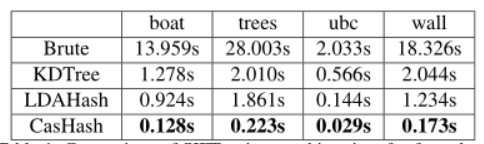

# Viewing Graph
首先我们来看看什么是Viewing Graph以及为什么Viewing Graph在重建中有什么作用？

```
A Viewing Graph is a graph which nodes represent images and edges represent the number of matches between two nodes.
```

**Viewing Graph** 实际上就是一个图，节点对应图片，边对应两幅图片之间的一些连接关系(可能包括匹配的数量，也包括两幅图片之间的一个相对运动关系)。Viewing Graph也叫做 **Match Graph**, 首先在[2]中提出一个比较明确的定义。

我们直到，特征点匹配一直是三维重建中一个瓶颈-不仅仅在于匹配比较费时间，而且很多错误的匹配也能通过geometric verification, 从而影响重建精度。而对于单对图片的匹配来说，提出新的加速算法也不能有效的提升匹配效率。从下表可以看到，最好的算法每对图片匹配也得花0.1s(这里我们考虑的是SIFT的128维描述子，而不是ORB之类的二进制描述子，并且ORB效果上不如SIFT)。
<div align=center> 



</div>
假设有1000张图片，那么穷举所有的情况需要做1000*(1000-1)/2次匹配。如果每次匹配花费0.1s，那么大约总共需要花费14个小时来做完这些匹配。而且这还只是1000张图片的情况！那么对于大规模的数据集(10000, 100000, ...)，在不考虑硬件方面提升的情况下，该怎么来加速匹配呢？

这就是Viewing Graph要做的事 - 通过减少大量不必要的匹配(很有可能是错配)，来提升匹配速度。


## 1. Vocabulary Tree
词汇树最初是用来做object recognition的，但是在三维重建中(SfM和SLAM)也被大量使用。

### 1.1 词汇树的构建
词汇树实际上就是一棵多层k叉树，通过反复的k-means聚类来得到。假设我们已经得到特征点的描述子，这些描述子则被用来构建词汇树。和原来的k-means聚类不同的是，原来的k指的是最终的聚类数量，而词汇树中的k指的是每一次迭代中的分支数目。首先，一个初始的k-means用于定义k个聚类中心，然后这些数据就被分成k组，每个组所包含的描述子到k-means聚类中心的距离最近。然后，该过程被反复调用，直到达到一个人为设定的参数-L层。如下图所示：
<div align=center> 


</div>
词汇树的内存大小和叶节点的数量成正比。对于D维的描述子，构建一棵L层k个分支的词汇树，需要Dk^L字节(假设描述子的每个维度占用1字节)。因此，对于128维的SIFT描述子，构建一棵6层的10分支的词汇树，会产生1M的叶节点，需要占用143M的内存。

### 1.2 评分(score)的定义
其实之前一直不太明白词汇树的评分怎么能够定义图片之间的相似度。然后看了参考文献[1]。词汇树的相似度借用了文本检索的方法。首先来看看文本检索中相似度怎么算的。

假设一个拥有k个单词的词汇表，那么每个文本可以被一个k维向量表示：

其中，每一项的计算公式为

<div align=center> 


</div>
其中，是单词i在文档d中出现的次数，是文档d中的单词总数，是单词i在整个数据库中出现的次数，N是整个数据库中的文档数。
这个权重定义方法称为Term Frequency-Inver Document frequency (TF-IDF) - 它由两项的乘积组成：word frequency 以及inverse document frequency 。这么做的intuition是(直接翻译不太好讲，就借用原文):

```word frequency weights words occurring ofter in a particular document, and thus describe it well, whilst the inverse document frequency down-weights words that appear ofter in the database.```

在检索的时候，文本根据查询向量v_q和其他所有向量v_d之间的归一化标量积(normalized scalar product)来排名。

但是在[2]里，对于图片之间的相似度评分，稍微做了修改。在词汇树中，查询图片和数据库中图片的相关性需要通过比较数据库中描述子沿着词汇树的路径和查询图片描述子沿着词汇树的路径的相似性(大致理解就是这样，原文是: we wish to determine the relevance of a database image to the query image based on how similar the paths down the vocabulary tree are for the descriptors from the database image and the query image)。[2]中的方法是：对词汇树中的每一个节点都赋予一个权值，并且定义查询向量和数据库向量：
<div align=center> 


</div>
其中和分别是所查询图片和数据库图片的描述子向量通过节点i的数量。的定义和[1]中IDF的定义相似：

<div align=center> 


</div>

其中N是数据库中图片的数量，是数据库中至少有一个描述子向量通过节点i的图片数量。然后查询向量和数据库向量之间的相似度评分通过下面的公式来定义：

<div align=center> 


</div>

实际上就是两个归一化之后的向量的差的范数。上面公式中的范数理论上可以使用任意形式的范数，但是[2]中发现L1-范数比L2-范数得到的结果要更好。

### 1.3 评分的实现

为了高效地进行评分，[2]使用了```inverted file```。inverted file存储的是某个节点出现在的图片的id(这个节点有可能在很多张图片中出现，因此存储了多个id)，以及该描述子在数据库中出现的总数。可以通过下图理解：
<div align=center> 


</div>

[2]中的实现只存储了叶节点的inverted file,而对于内部节点的inverted file，就是叶节点的inverted files的简单的连接。也可以通过下图理解：
<div align=center> 


</div>

到此，词汇树的基本上讲解完了，更细节的内容还是见[1,2]两篇参考文献。对于vocabulary tree的实现，可以见Tianwei的工作[libvot](https://github.com/hlzz/libvot)以及Noah Snavely大神的实现[VocabTree2](https://github.com/snavely/VocabTree2)。

## 2. Build Rome in a Day (BRIAD)<sup>[3]</sup>

在[3]中，词汇树用于计算图片之间的相似度。对于每张图片，取相似度得分前k1+k2张图片，其中的k1张图片用于初始的建图步骤，额外的k2张图片用于对连通分量(connected components)进行扩展/增大。在初始图构建完之后，可能存在多个连通分量。也就是说，整个场景肯定不是完整的。对于连通分量大于等于2的情况，接下来的k2张图片便被用于连接起这些连通分量。需要注意的是，只有处于不同连通分量之间的图片对才被考虑进来。这个过程称作"Components merging"。在component merging之后，匹配图通常还不够稠密来较为可靠地进行重建。因此，“Query Expansion"的步骤被提出来强化viewing graph. Query expansion的意思就是，如果图片i和图片j是一个正确匹配(匹配点的个数足够并且通过了geometric verification)，图片j和图片k是一个正确的匹配，那么接下来就尝试验证i和k是不是一个正确的匹配。Query expansion会在迭代一个固定的次数之后终止，也就得到了最终的一个match graph。

但是，query expansion存在一个缺点：当query expansion重复一定次数之后，用于进行匹配的图片很快就和原图片相差很大了(也就意味着相似度不够，可能是错误的匹配)。正因为做了这些错误的匹配，query expansion会导致drift。尽管geometric verification用于筛除不满足对极几何的匹配，但是这些不必要的校验依然会降低匹配效率。


## 3. Graph-based Consistency Matching
这篇工作尝试通过回环一致性来检测坏的匹配对。它的intuition在于：错误的匹配会造成较大的误差累积，并且一些错误的匹配能够在更长的路径中通过回环一致性检测出来。

为了检验回环一致性，这篇文章中定义了两个术语：Weak Consistency和Strong Consistency。Weak consistency对应于较短路径下的回环一致性(三个节点两条边，路径长度为2)，Strong consistency对应于较长路径下的回环一致性 (路径长度不是一个定值)。consistency指的是图片间的相对运动通过矩阵链乘得到的结果和单位阵之差的范数应当小于某个阈值。

为了找到一个一致的match graph，需要对以下三个性能标准进行平衡:

- 完整性 (completeness)
- 效率 (efficiency)
- 一致性 (consistency)

通过这三个标准，Shen [4]的方法可以找到一个能够进行完整重建的匹配对的下界。该算法包含下面三个步骤。

### 3.1 Match Graph Initilization
Shen [4]使用词汇树得到的相似度评分作为一个初始图的权值 (实际上该权值的定义没有这么简单，这里为了简便就这样写，具体可以见参考文献)，然后构建出一棵最小生成树。需要注意的是，如果图片集合包含一些孤立的视图(singleton views)或者分块的场景，图的初始化过程可能会耗费比较长的时间，因为我们需要遍历每一条边来尝试把singleton image加入到图里面。这个图初始化算法比较简单，可以通过对Kruskal算法做略微的修改得到。


## 3.2 Graph Expansion by Strong Triplets

这个过程称作三元组扩展。其实思路和[3]的query expansion差不多： 如果图片i和图片j是一个正确匹配，图片j和图片k是一个正确的匹配，那么接下来就尝试验证i和k是不是一个正确的匹配。不过稍有不同的是，这个过程还验证了loop consistency。而且，为了保证效率，triplets expansion的过程只做三次(因为做所有的triplets expansion的时间复杂度是O(n^3))。整个过程如下图所示：

<div align=center> 


</div>

### 3.3 Component Merging
这一步是对triplets expansion步骤的一个扩展。在triplets expansion中，只有局部的几何信息被考虑到，这意味着并没有考虑一个全局的回环结构，因此也就无法反映出整个数据集的潜在的位姿图。除此之外，更长的回环被忽略掉了。因此，component merging这一步被提出来强化之前的match graph。

通过community detection，图被划分成几块区域，区域内的图片有着较为紧密的联系，区域之间的图片联系较弱。因此，组间的更长的路径被用于检验回环一致性。假设图片i在编号为k1的组内，图片j在编号为k2的组内，接着，使用广度优先搜索算法寻找这两张图片的最短路径(这个时候，边的权值设为1)，然后所有边之间的相对运动的矩阵表示便被用于检验strong consistency.

需要注意的是，一般情况下，图割算法可以作为community detection的一个代替。

## 4. GraphMatch
尽管词汇树能够用于快速寻找潜在的匹配对，但是，词汇树仍然存在一些缺点：

- 构建一棵词汇树的代价比较大(当然，现在有一些训练好的词汇树可以用)并且需要较大的内存。

- 在大规模的图片中，SfM系统需要将所有图片的索引加载到内存中来寻找合适的图片对进行匹配。这种情况下，潜在的内存开系哦啊依然非常大

除此之外，词汇树并不是一种很可信的寻找正确匹配的方法 - 用词汇树来对图片进行表示对于匹配来说提供的信息非常有限，就像下图所示，词汇树的相似度评分对于匹配和非匹配的概率分布图来说，重合度非常大(也就是说，词汇树并不能有效区分匹配和不匹配的图片)。
<div align=center> 


</div>

因此， GraphMatch[4]通过实验，对比使用了一些比词汇树更能有效地区分匹配和不配的图片对的方法。他们的实验结果表明，
```
Fisher vector distances are faster to compute and more indicative of a possible match than vocabulary tree similarity scores.
```
如下面的概率分布图所示：
<div align=center> 


</div>

GraphMatch算法分为三个步骤(实际上和之前的算法大同小异)：

### 4.1 预处理 (Pre-processing)
首先，计算SIFT特征以及描述子，然后，使用Fisher-vector encoder来计算Fisher vector。在每一张图片的Fisher vector都计算完之后，GraphMatch对每对图片都计算一个distance matrix。最后，这些Fisher distances用来对所有图片进行一个相似度的排名。越小的Fisher distance意味着越高的相似度。

### 4.2 采样和冒泡 (Sampling and Propagation)

实际上，这里的采样和冒泡个人觉得仅仅是这篇文章包装之后的说法，和前面两篇论文的做法并无本质上的区别。

采样是指，对于之前排名的结果，每张图片都选一个固定的值来选取图片进行匹配。而冒泡指的是(还是引用原文吧，翻译感觉没必要):
```
Given a pair *A* and *B* that share an edge, the propagation step takes the top ranked neighbors of B and tests them against *A* and vice-versa. And GraphMatch propagates only from vertices that have less that *MAXNUMNEIGHBORS* for termination criterion.
```

## 5. 实现

自己目前还没找到关于viewing graph的一个开源实现。因为viewing graph对于构建大规模重建系统确实是必要的，因此自己也正在实现。代码可见 [XFeatures]()

## References
[1] Sivic J, Zisserman A. Video Google: A text retrieval approach to object matching in videos[C]//null. IEEE, 2003: 1470.

[3] Nister D, Stewenius H. Scalable Recognition with a Vocabulary Tree[J]. Proc Cvpr, 2006, 2(10):2161-2168.

[3] Agarwal S , Snavely N , Simon I , et al. Building Rome in a day[C]// IEEE International Conference on Computer Vision. IEEE, 2009.

[4] Shen T, Zhu S, Fang T, et al. Graph-Based Consistent Matching for Structure-from-Motion[C]// European Conference on Computer Vision. 2016.

[5] Cui Q, Fragoso V, Sweeney C, et al. GraphMatch: Efficient Large-Scale Graph Construction for Structure from Motion[J]. 2017.